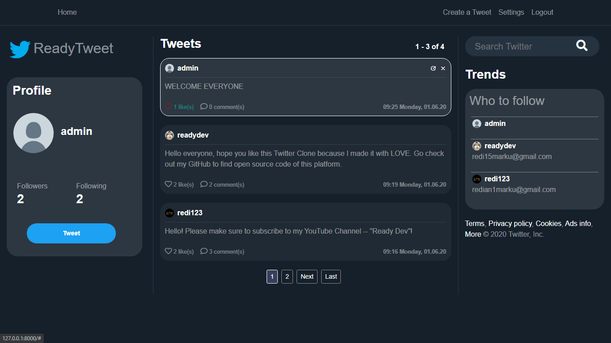

# Django Twitter Clone by Redian Marku

Fully functional Django App that looks ecxatly like real Twitter.

Demo Image:


## Setup

1. Git Clone the project with: ```https://github.com/jhonshua/Red_Social_Django```.

2. Move to the base directory: ```cd Django-Twitter-Clone```

3. Create a new python enveronment with: ```python -m venv env```.

4. Activate enveronment with: ```env\Scripts\activate``` on windows, or ```source env/bin/activate``` on Mac and Linux.

5. Install required dependences with: ```pip install -r requirements.txt```.

6. Make migrations with: ```python manage.py makemigrations``` and then ```python manage.py migrate```.

7. Run app localy with: ```python manage.py runserver```.

