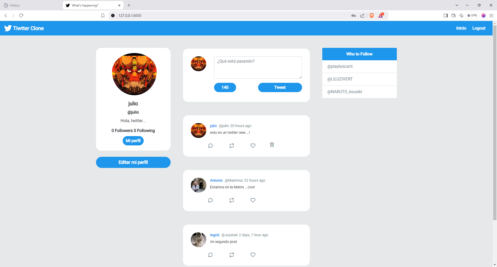
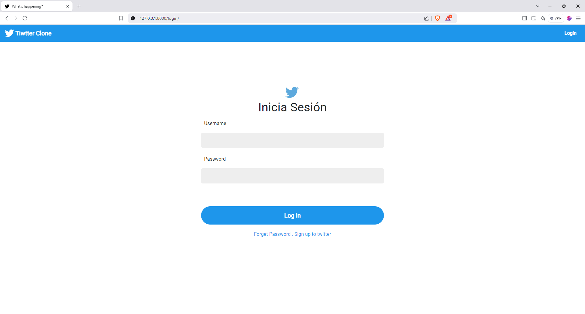
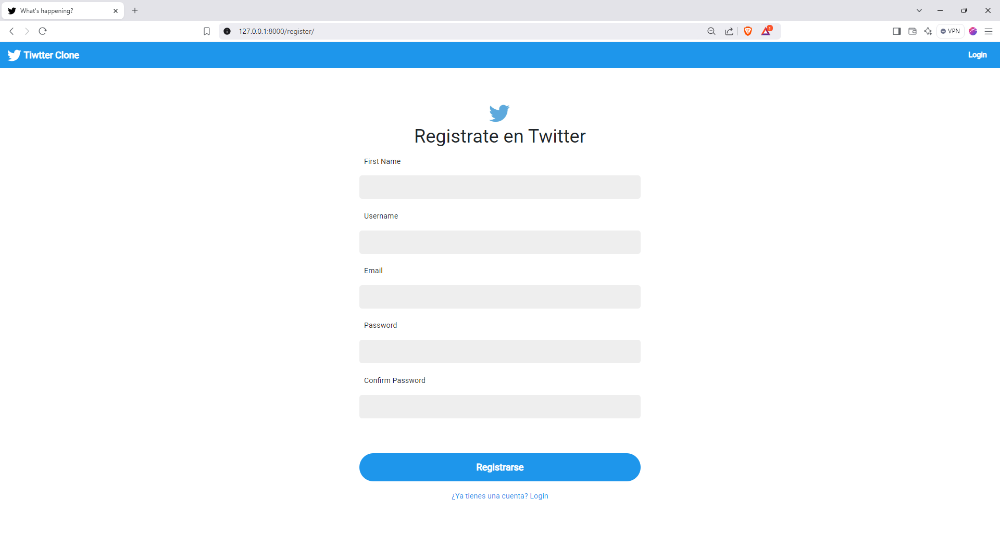

# Django Red-Social de Julio Llinas

Aplicación Django totalmente funcional que se ve parecida como el Twitter .

Demo Image:








## Setup

1. Git Clone el proyecto con: ```https://github.com/jhonshua/Red_Social_Django```.

2. Moverse al directorio: ```cd Django-Twitter-Clone```

3. Create a new python enveronment with: ```python -m venv env```.

4. Activar el entorno virtual: ```env\Scripts\activate``` en windows, o ```source env/bin/activate``` o Mac and Linux.

5. Instalar con: ```pip install -r requirements.txt```.

6. Realizar las migraciones de los modelos: ```python manage.py makemigrations``` y luego ```python manage.py migrate```.

7. Arrancar la app: ```python manage.py runserver```.

## Estructura de carpetas propuesta:    


├── django_projecty/     # Esta es la raíz de tu proyecto de Django. Aquí se encuentran los archivos de configuración principales y las aplicaciones.                   
├── env/                 # entorno virtual          
├── static/              # archivos estáticos de tu proyecto (CSS, JavaScript, imágenes).   
├── templates/           # Aquí se encuentra tu entorno virtual, que te permite aislar las dependencias de tu proyecto.     
├── twitter/             # Esta es la primera aplicación que has creado para tu proyecto. Contiene los archivos específicos de esta aplicación (models.py, views.py, urls.py, etc.).            
├── .env                 # variables de entorno de desarrollo       
├── .gitignore          # archivos y carpetas que no deben serversionados           
├── license             # licencia del proyecto                 
├── manage.py           # ejecutar comandos de Django                   
├── README.md           # información sobre el proyecto                 
└── requirements.txt    # listar las dependencias                                
  